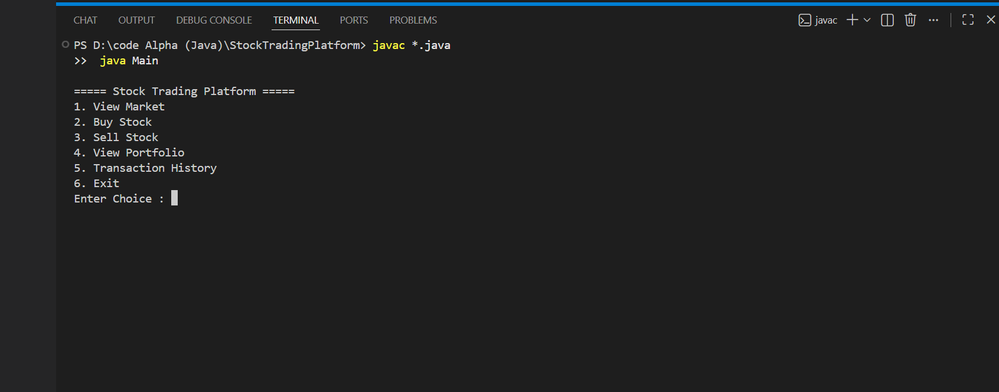

# Stock Trading Platform

A Java console-based Stock Trading Platform developed as part of the CodeAlpha Java Programming Internship. This project demonstrates the implementation of Object-Oriented Programming concepts by simulating a basic stock trading environment where users can buy and sell stocks, manage their portfolio, and track transaction history.

---

## ━━━━━━━━━━━━━━━━━━━━━━━━━━━━━━━━━━━

## Description

## ━━━━━━━━━━━━━━━━━━━━━━━━━━━━━━━━━━━

The Stock Trading Platform is a menu-driven Java application that allows users to interact with a simulated stock market. Users can view available stocks, purchase shares, sell owned shares, monitor their portfolio, and review transaction history. The project is designed to strengthen Java programming skills while applying Object-Oriented Programming concepts to a real-world scenario.

---

## ━━━━━━━━━━━━━━━━━━━━━━━━━━━━━━━━━━━

## Features

## ━━━━━━━━━━━━━━━━━━━━━━━━━━━━━━━━━━━

* Display available stocks and their prices.
* Buy stocks using the available balance.
* Sell previously purchased stocks.
* View portfolio with current holdings.
* Display complete transaction history.
* Calculate remaining balance and total portfolio value.
* Validate invalid stock symbols and insufficient shares.

---

## ━━━━━━━━━━━━━━━━━━━━━━━━━━━━━━━━━━━

## Technologies Used

## ━━━━━━━━━━━━━━━━━━━━━━━━━━━━━━━━━━━

* Java
* Object-Oriented Programming (OOP)
* HashMap
* ArrayList
* Scanner Class

---

## ━━━━━━━━━━━━━━━━━━━━━━━━━━━━━━━━━━━

## Project Structure

## ━━━━━━━━━━━━━━━━━━━━━━━━━━━━━━━━━━━

```text
StockTradingPlatform/
│
├── Main.java
├── Stock.java
├── StockMarket.java
├── User.java
├── Transaction.java
├── README.md
└── Screenshots/
    ├── MainMenu.png
    ├── MarketAndBuyStock.png
    ├── BuyAndSellStock.png
    └── TransactionHistory.png
```

---

## ━━━━━━━━━━━━━━━━━━━━━━━━━━━━━━━━━━━

## How to Run

## ━━━━━━━━━━━━━━━━━━━━━━━━━━━━━━━━━━━

1. Clone the repository.

2. Open the project in Visual Studio Code or any Java IDE.

3. Compile the project.

```bash
javac *.java
```

4. Run the application.

```bash
java Main
```

---

## ━━━━━━━━━━━━━━━━━━━━━━━━━━━━━━━━━━━

## Sample Operations

## ━━━━━━━━━━━━━━━━━━━━━━━━━━━━━━━━━━━

* View available stocks.
* Buy stocks.
* Sell stocks.
* View portfolio.
* Display transaction history.
* Exit the application.

---

## ━━━━━━━━━━━━━━━━━━━━━━━━━━━━━━━━━━━

## Screenshots

## ━━━━━━━━━━━━━━━━━━━━━━━━━━━━━━━━━━━

### Main Menu



---

### Market and Buy Stock


---

### Buy and Sell Stock


---

### Transaction History


---

## ━━━━━━━━━━━━━━━━━━━━━━━━━━━━━━━━━━━

## Future Enhancements

## ━━━━━━━━━━━━━━━━━━━━━━━━━━━━━━━━━━━

* Store portfolio data using file handling.
* Add user authentication.
* Implement dynamic stock price updates.
* Develop a graphical user interface (GUI).
* Integrate a database for persistent storage.
* Add profit and loss analysis.

---

## ━━━━━━━━━━━━━━━━━━━━━━━━━━━━━━━━━━━

## Author

## ━━━━━━━━━━━━━━━━━━━━━━━━━━━━━━━━━━━

**Name:** Sameer Raj

**Internship:** CodeAlpha Java Programming Internship

---

## ━━━━━━━━━━━━━━━━━━━━━━━━━━━━━━━━━━━

## Conclusion

## ━━━━━━━━━━━━━━━━━━━━━━━━━━━━━━━━━━━

The Stock Trading Platform successfully demonstrates the core concepts of Java programming and Object-Oriented Programming through a practical stock market simulation. The application provides an interactive console-based experience for buying and selling stocks, managing portfolios, and tracking transaction history. This project serves as a strong foundation for developing more advanced trading applications with features such as file handling, database integration, and graphical user interfaces.
